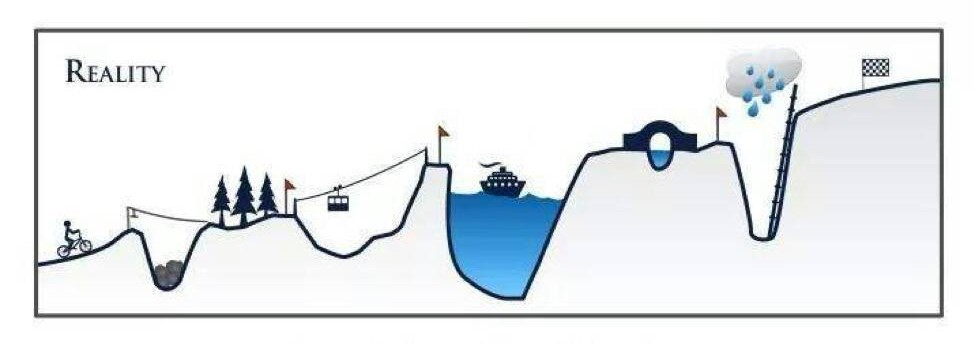
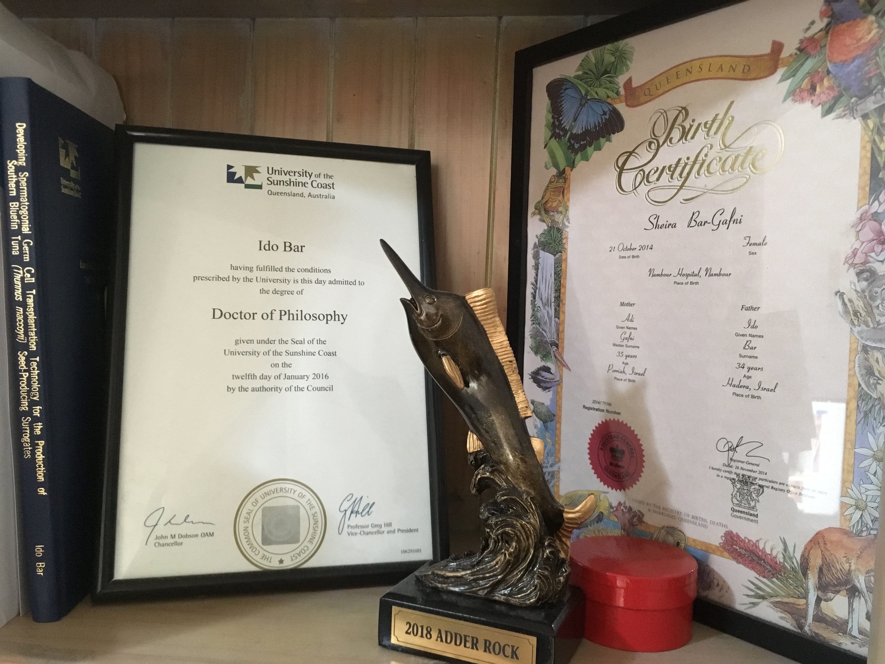

class: title-slide

```{r setup, include=FALSE}
options(htmltools.dir.version = FALSE)
```


# How to make it through a PhD?  &nbsp; &nbsp;`r icon::fa("user-graduate")`


### Ido Bar | PhD
### Griffith University 
### Environmental Futures Research Institute

<font color="#1DA1F2" size="6">`r icon::fa("twitter")`</font> [@DrIdoBar](https://twitter.com/DrIdoBar) &nbsp; &nbsp; &nbsp; <font color="#ED1C24" size="6">`r icon::fa("paper-plane")`</font> [i.bar@griffith.edu.au](mailto::i.bar@griffith.edu.au) &nbsp; &nbsp; &nbsp; <font size="6">`r icon::fa("github")`</font> [IdoBar](https://github.com/idobar)

---
## Layout

- PhD is a long and winding road
- Full of obstacles and hardships
- But you're not doing it on your own
- The harder it gets the closer you get to your peers
- They will pull you up when needed (and you will pull them)
- What is it for? What's the end result
- You becoming stronger, more resilient, independant, mature
- It's your journey, enjoy it!


---
name: steps-to-phd
class: top, left, animated, fadeIn
 
# Steps to PhD


.foot-credit[Image credit: [Graduate and Postdoctoral Studies - University of British Columbia](https://www.grad.ubc.ca/current-students/professional-development/graduate-game-plan)]

---
name: road-to-phd
class: top, left, animated, fadeIn

# Actual road to PhD

--

.pull-left[

]

<br>
</br>

--

.pull-bottom[.pull-right[
]]

---
name: obstacles
class: top, left, animated, fadeIn


# Hurdles and Obstacles



--
## How to cope?

???
- Breakups (serious!)
- Mental health
- Loneliness
- Child loss


---
name: alone-in-the-mud
class: top, left, animated, fadeIn
background-size: contain
background-image: url(https://media.defense.gov/2016/Jul/27/2001584326/-1/-1/0/160716-A-EQ933-021.JPG) 

.foot-credit[Image credit: [Staff Sgt. Clifford Coy](https://www.usar.army.mil/Commands/Geographic/63rd-Readiness-Division/Photo-Page/igphoto/2001584326/)]

## .white[It feels like this]

---
name: together-in-mud
class: top, left, animated, fadeIn
background-size: contain
background-image: url(https://i1.wp.com/toughmudder.com.au/wp-content/uploads/2018/12/46493611_1912900635432170_3984463782091948032_o.jpg?fit=1848%2C1230&ssl=1)


.foot-credit[Image credit: [Mathew Farrell](https://toughmudder.com.au)]

## .white[It is more like this]

---
name: more-in-mud
class: top, left, animated, fadeIn
background-size: contain
background-image: url(https://media.defense.gov/2012/Feb/15/2000178303/-1/-1/0/120212-F-QU140-134.JPG)

.foot-credit[Image credit: [U.S. Air Force photo/Staff Sgt. Alexy Saltekoff](https://www.afrc.af.mil/News/Article-Display/Article/157039/airmen-prove-they-are-tough-mudders/)]

## .white[Or like this]

---
name: crawling-in-mud
class: bottom, right, animated, fadeIn
background-size: contain
background-image: url(https://upload.wikimedia.org/wikipedia/commons/f/f3/Defense.gov_News_Photo_110408-A-3108M-004_-_U.S._Army_1st_Lt._Andrew_McKinley_crawls_through_a_muddy_obstacle_as_he_and_his_team_of_officers_complete_a_testing_course_during_Prop_Blast_a.jpg)

## On tough days, even this

.left[.foot-credit[Image credit: [Von Sgt. Michael J. MacLeod, U.S. Army - www.defense.gov, Gemeinfrei](https://commons.wikimedia.org/w/index.php?curid=20679138)]]

---
name: pull-you-out
class: top, left, animated, fadeIn
background-size: contain
background-image: url(https://upload.wikimedia.org/wikipedia/commons/thumb/5/5e/RuggedManiacWallHelp.jpg/1920px-RuggedManiacWallHelp.jpg)

.foot-credit[Image credit: [Von Jsslee - Eigenes Werk, CC BY-SA 4.0](https://commons.wikimedia.org/w/index.php?curid=44779272)]

---

name: graduation
class: top, left, animated, fadeIn

# What is it for?
--


---

name: thesis-on-shelf
class: top, left, animated, fadeIn

# What is it for?
--




---
name: you
class: top, left, animated, fadeIn
background-size: contain
background-image: url("img/we-want-you-png-93-images-in-collection-page-1-i-want-you-png-1538_921.png")

# YOU!

---
name: tweet
class: middle, center, animated, fadeIn

# Most significant output

<blockquote class="twitter-tweet" data-lang="en"><p lang="en" dir="ltr">Ten years after closing my lab, I've concluded that my most significant contribution to science in my twenty years as a active researcher wasn't a paper or a finding. It was the scientists that I mentored.</p>&mdash; Mary Ellen Lane (@MaryEllenLane29) <a href="https://twitter.com/MaryEllenLane29/status/1144025194752819201?ref_src=twsrc%5Etfw">June 26, 2019</a></blockquote>


---
name: summary

class: top, left, animated, fadeIn
background-size: contain
background-image: url(http://phdcomics.com/comics/archive/phd030110s.gif)

.foot-credit[Image credit: [Jorge Cham @ 2010](http://phdcomics.com/comics/archive.php?comicid=1286)]

---
name: balance
class: top, left, animated, fadeIn
background-size: contain
background-image: url(https://live.staticflickr.com/2631/3947478553_afa6c3aa1a_o.png)

.foot-credit[Image credit: [Pirate Unicycle | by frozenhaddock](https://creativecommons.org/licenses/by-nc-sa/2.0/)]

