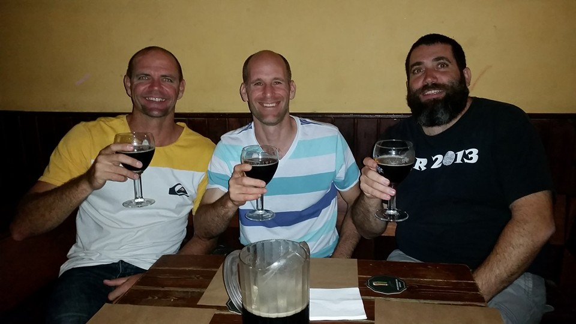
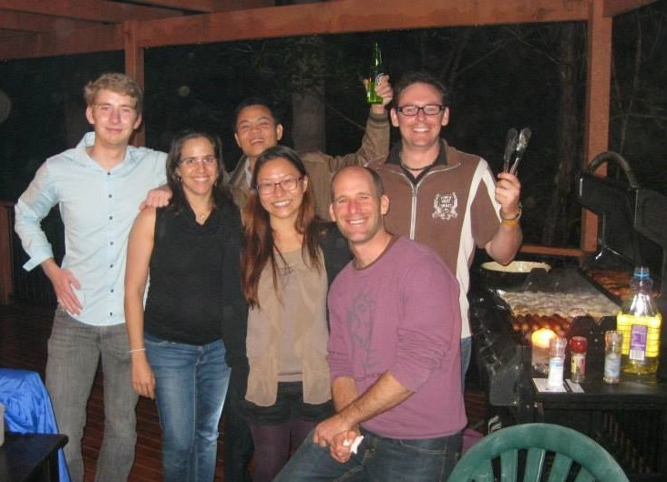

class: title-slide

```{r setup, include=FALSE}
pacman::p_load(icon, xaringan)
options(htmltools.dir.version = FALSE)
```


# How (or why) to make it through a PhD?  &nbsp; &nbsp;`r icon::fa("user-graduate")`

<br>
<br>

### Ido Bar | PhD
### Griffith University 
### Environmental Futures Research Institute

<font color="#1DA1F2" size="6">`r icon::fa("twitter")`</font> [@DrIdoBar](https://twitter.com/DrIdoBar) &nbsp; &nbsp; &nbsp; <font color="#ED1C24" size="6">`r icon::fa("paper-plane")`</font> [i.bar@griffith.edu.au](mailto::i.bar@griffith.edu.au) &nbsp; &nbsp; &nbsp; <font size="6">`r icon::fa("github")`</font> [IdoBar](https://github.com/idobar)


---
name: steps-to-phd
class: top, left, animated, fadeIn
 
# Road to PhD


.foot-credit[Image credit: [Graduate and Postdoctoral Studies - University of British Columbia](https://www.grad.ubc.ca/current-students/professional-development/graduate-game-plan)]

---
name: road-to-phd
class: top, left, animated, fadeIn

# Actual road to PhD

.pull-left[

]

<br>
</br>

--

.pull-bottom[.pull-right[
]]


???

- PhD is a long and winding road
- Full of obstacles and hardships

---
name: academic-obstacles
class: top, left, animated, fadeIn


# Hurdles and Obstacles


--
.big[Academic] 

- Experimental
- Milestones
- Writing
- Supervisor

---

# Progress meetings with your supervisor

.pull-left[.big[.black[The pit of Despair]] <br><br/> ]


--
<div style="position: absolute; 
  bottom: 50px; right: 100px">  <a href="http://freegifmaker.me/images/2fJ9v/"></a><br/><a href="http://www.freegifmaker.me/">FreeGifMaker.me<a/> </div>


---
name: personal-obstacles
class: top, left, animated, fadeIn


# Hurdles and Obstacles


--
### Personal

- Breakups (serious!)
- Mental health
- Loneliness
- Child birth and loss

---
name: crawling-in-mud
class: bottom, right, animated, fadeIn
background-size: contain
background-image: url(https://upload.wikimedia.org/wikipedia/commons/f/f3/Defense.gov_News_Photo_110408-A-3108M-004_-_U.S._Army_1st_Lt._Andrew_McKinley_crawls_through_a_muddy_obstacle_as_he_and_his_team_of_officers_complete_a_testing_course_during_Prop_Blast_a.jpg)

## A day in the (PhD) life...

.left[.foot-credit[Image credit: [Von Sgt. Michael J. MacLeod, U.S. Army - www.defense.gov, Gemeinfrei](https://commons.wikimedia.org/w/index.php?curid=20679138)]]

???
- Trying to keep your head above the muddy water
- Maybe add a slide about writing block

---
name: alone-in-the-mud
class: top, left, animated, fadeIn
background-size: contain
background-image: url(https://media.defense.gov/2012/Feb/15/2000178303/1088/820/0/120212-F-QU140-134.JPG) 

.foot-credit[Image credit: [U.S. Air Force photo/Staff Sgt. Alexy Saltekoff](https://www.afrc.af.mil/News/Photos/igphoto/2000178303/)]

## .white[It feels like this]

---
name: together-in-mud
class: top, left, animated, fadeIn
background-size: contain
background-image: url(https://i1.wp.com/toughmudder.com.au/wp-content/uploads/2018/12/46493611_1912900635432170_3984463782091948032_o.jpg?fit=1848%2C1230&ssl=1)

.foot-credit[Image credit: [Mathew Farrell](https://toughmudder.com.au)]

## .white[It is more like this]

???
The chemistry of hardship:
The harder it gets, the closer you get to your peers
---
name: pull-you-out
class: top, left, animated, fadeIn

# The (Al)chemistry of hardship
.right-column[]
.lef-column[.big[The harder it gets, the stronger it bonds]]

.foot-credit[Image credit: [Von Jsslee - Eigenes Werk, CC BY-SA 4.0](https://commons.wikimedia.org/w/index.php?curid=44779272)]

## .white[Your friends will reach out]

???

- They will pull you up when needed (and you will pull them)

---

# Comradery 

.pull-left[]


.pull-right[]

???

- In the toughest moments, your friends will be there for you as a safety net

 
---

name: poll_results
class: top, left, animated, fadeIn
# What do you expect to get from your PhD?

.left-column[ <br> .big[Scan the QR code to fill a quick poll (in a word or two)]]
.right-column[<iframe src="https://embed.polleverywhere.com/free_text_polls/xTzrbqnYFqsEX2CtfnHw8?controls=none&short_poll=true" width="640" height="480" frameBorder="0"></iframe>]


---

name: thesis-on-shelf
class: top, left, animated, fadeIn

# So what is it for?
--


???

- Birth certificate
- Kayak fishing trophy
- PhD award and Thesis

---
name: you
class: top, left, animated, fadeIn
background-size: contain
background-image: url("img/we-want-you-png-93-images-in-collection-page-1-i-want-you-png-1538_921.png")

# YOU!

---
name: tweet
class: top, left, animated, fadeIn

# Most significant output
<br>
<br>

<blockquote class="twitter-tweet" data-lang="en" align="center"><p lang="en" dir="ltr">Ten years after closing my lab, I've concluded that my most significant contribution to science in my twenty years as an active researcher wasn't a paper or a finding. It was the scientists that I mentored.</p>&mdash; Mary Ellen Lane (@MaryEllenLane29) <a href="https://twitter.com/MaryEllenLane29/status/1144025194752819201?ref_src=twsrc%5Etfw">June 26, 2019</a></blockquote>

---

# What is it for?
## Becoming a better researcher (you!)

.pull-left[.big[
- Expert in your field
- Independent
- Mature
- Strong/Resilient
- Connected
]]

--

.pull-right[]

???

- What is it for? What's the end result
- You becoming stronger, more resilient, independent, mature
- You all know who I mean...


---

<script src="https://unpkg.com/masonry-layout@4/dist/masonry.pkgd.min.js"></script>

# My best advice?

--
## Invest in your social life and wellbeing

<div class="grid" style="text-align:center">

  <div class="grid-item grid-item--width2"></div>
  <div class="grid-item"></div>
  <div class="grid-item grid-item--width2"></div>
  <div class="grid-item "></div>
  <div class="grid-item grid-item--width2"></div>
  <div class="grid-item grid-item--width2"></div>
  
</div>
 
???

- It's your journey, enjoy it!

---
name: summary

class: top, left, animated, fadeIn
background-size: contain
background-image: url(http://phdcomics.com/comics/archive/phd030110s.gif)

.foot-credit[Image credit: [Jorge Cham @ 2010](http://phdcomics.com/comics/archive.php?comicid=1286)]
???

- Enjoy it while you can...
- You're a protected species, you can still make mistakes, take time off, go the the pool/gym/beach 
- Life only gets more complicated

---
class: title-slide-final, left


# Thank you! 


<font color="#1DA1F2" size="6">`r icon::fa("twitter")`</font> [.white[@DrIdoBar]](https://twitter.com/DrIdoBar) &nbsp; &nbsp; &nbsp; <font color="#ED1C24" size="6">`r icon::fa("paper-plane")`</font> [.white[i.bar@griffith.edu.au]](mailto::i.bar@griffith.edu.au) &nbsp; &nbsp; &nbsp; <font size="6">`r icon::fa("github")`</font> [.white[IdoBar/ResBazBris2019]](https://idobar.github.io/ResBazBris2019/)


